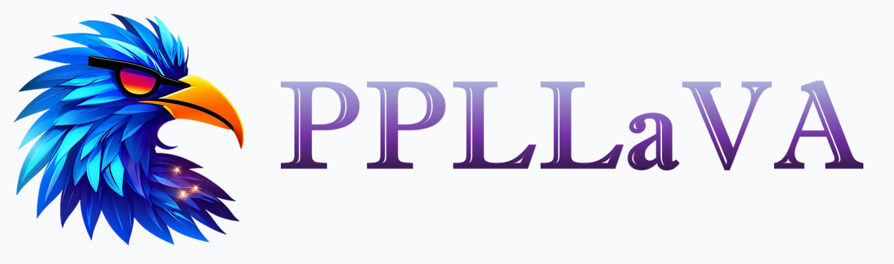
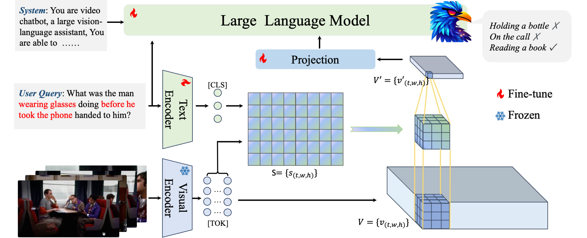
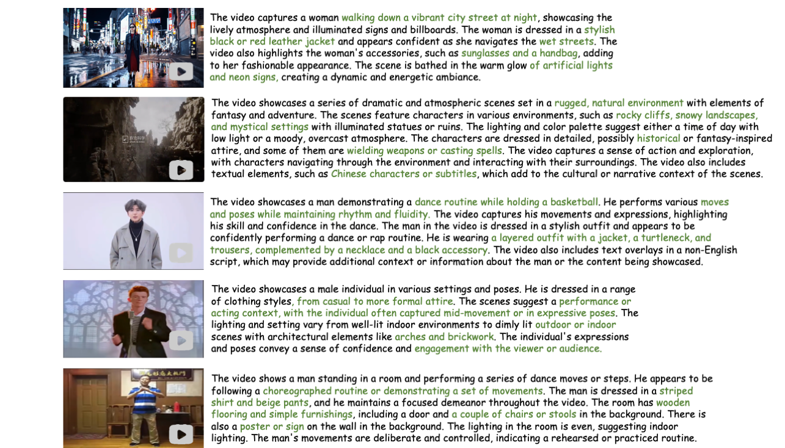
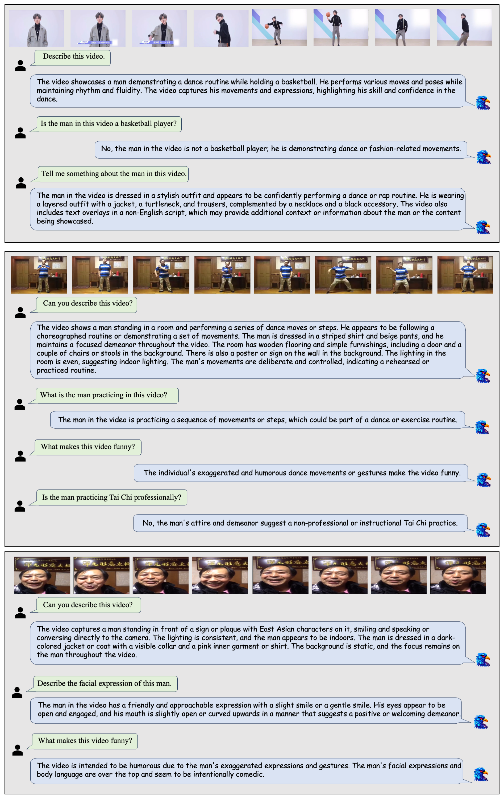

<p align="center" width="100%">
<a target="_blank"></a>
</p>
<h2 align="center"> <a href="https://arxiv.org/abs/2411.02327">PPLLaVA: Varied Video Sequence Understanding With Prompt Guidance</a></h2>

<h5 align=center>

[](https://huggingface.co/farewellthree/ppllava_weight/tree/main)
[](https://arxiv.org/abs/2411.02327)
[](https://github.com/farewellthree/PPLLaVA/blob/main/LICENSE)
[](https://github.com/farewellthree/PPLLaVA-NPU)
</h5>

[](https://paperswithcode.com/sota/video-based-generative-performance?p=ppllava-varied-video-sequence-understanding)
[](https://paperswithcode.com/sota/video-based-generative-performance-1?p=ppllava-varied-video-sequence-understanding)
[](https://paperswithcode.com/sota/video-based-generative-performance-4?p=ppllava-varied-video-sequence-understanding)
[](https://paperswithcode.com/sota/video-based-generative-performance-3?p=ppllava-varied-video-sequence-understanding)
[](https://paperswithcode.com/sota/video-based-generative-performance-5?p=ppllava-varied-video-sequence-understanding)
[](https://paperswithcode.com/sota/video-based-generative-performance-2?p=ppllava-varied-video-sequence-understanding)
[](https://paperswithcode.com/sota/video-question-answering-on-mvbench?p=ppllava-varied-video-sequence-understanding)
[](https://paperswithcode.com/sota/zeroshot-video-question-answer-on-activitynet?p=ppllava-varied-video-sequence-understanding)
[](https://paperswithcode.com/sota/zeroshot-video-question-answer-on-msrvtt-qa?p=ppllava-varied-video-sequence-understanding)
[](https://paperswithcode.com/sota/zeroshot-video-question-answer-on-msvd-qa?p=ppllava-varied-video-sequence-understanding)

## News :loudspeaker:
* **[2024/11/4]**  We have added the gradio chatbox, see the [instruction](README.md#Demo).
* **[2024/10/28]**  All codes and weights are available now! Welcome to watch this repository for the latest updates.
  
## Introduction :bulb:

- **PPLLaVA** is an effective and efficient video large language model. Our model incorporates three parts: 
  - (1) Fine-grained vision-prompt alignment.
  - (2) Visual token compression by user instruction with convolution-style pooling.
  - (3) CLIP context extension.

<div align=center>

</div>


- **PPLLaVA** has established new state-of-the-art results on VideoMME, MVBench, VideoChatGPT Bench, and VideoQA Bench, using only **1024** visual tokens and achieving a throughput **8x** faster.
<div align="center">
<table border="1" width="100%">
  <tr align="center">
        <th>Method</th><th>Image Pretrain</th><th>LLM</th><th>VideoMME</th><th>VCGBench</th><th>MVBench</th><th>ActivityNetQA</th>
    </tr>
  <tr align="center">
        <td>VideoLLaMA</td><td>BLIP-2</td><td>Vicuna-7B</td><td>-</td><td>1.96</td><td>34.1</td><td>12.4</td>
    </tr>
  <tr align="center">
        <td>LLaMA-Adapter</td><td>-</td><td>Vicuna-7B</td><td>-</td><td>2.03</td><td>31.7</td><td>34.2</td>
    </tr>
  <tr align="center">
        <td>VideoChat</td><td>BLIP-2</td><td>Vicuna-7B</td><td>-</td><td>2.23</td><td>35.5</td><td>26.5</td>
    </tr>
  <tr align="center">
        <td>VideoChatGPT</td><td>LLaVA-1.0</td><td>Vicuna-7B</td><td>-</td><td>2.38</td><td>32.7</td><td>35.2</td>
    </tr>
  <tr align="center">
        <td>BT-Adapter</td><td>LLaVA-1.0</td><td>Vicuna-7B</td><td>-</td><td>2.69</td><td>-</td><td>45.7</td>
    </tr>
  <tr align="center">
        <td>LLaMA-VID</td><td>InstructBLIP</td><td>Vicuna-13B</td><td>-</td><td>2.89</td><td>-</td><td>47.4</td>
    </tr>
  <tr align="center">
        <td>VideoChat2</td><td>-</td><td>Vicuna-7B</td><td>-</td><td>2.98</td><td>51.1</td><td>49.1</td>
    </tr>
  <tr align="center">
        <td>Chat-UniVi</td><td>LLaVA-1.5</td><td>Vicuna-7B</td><td>45.9</td><td>2.99</td><td>-</td><td>47.2</td>
    </tr>
  <tr align="center">
        <td>STLLM</td><td>InstructBLIP</td><td>Vicuna-7B</td><td>42.3</td><td>3.15</td><td>-</td><td>50.9</td>
    </tr>
  <tr align="center">
        <td>PLLaVA</td><td>LLaVA-Next</td><td>Vicuna-7B</td><td>-</td><td>3.12</td><td>46.6</td><td>56.3</td>
    </tr>
  <tr align="center">
        <td>VLM-RLAIF</td><td>LLaVA-1.5</td><td>Vicuna-7B</td><td>-</td><td>3.49</td><td>-</td><td>57.3</td>
    </tr>
  <tr align="center">
        <td>LLaVA-Next-Video</td><td>LLaVA-Next</td><td>Vicuna-7B</td><td>45.0</td><td>3.66</td><td>-</td><td>60.2</td>
    </tr>
  <tr align="center">
        <td>PPLLaVA</td><td>LLaVA-Next</td><td>Vicuna-7B</td><td><b>53.6</b></td><td><b>3.73</b></td><td><b>59.2</b></td><td><b>60.7</b></td>
    </tr>
</table>
</div>

## Demo 🤗
Please download the conversation weights from [here](https://huggingface.co/farewellthree/ppllava_weight/tree/main/ppllava_vicuna7b_image_video_dpo) and follow the instructions in [installation](README.md#Installation) first. Then, run the gradio demo:
```
CUDA_VISIBLE_DEVICES=0 python3 demo.py --ckpt-path /path/to/PPLLaVA_conversation_weight
```

## Examples 👀
- **Video Dense Caption: PPLLaVA can effectively balance the content, state, and motion of both the foreground and background, while maintaining detail and accuracy.**
<div align=center>

</div>

- **Multi-turn dialogue and reasoning: PPLLaVA can engage in smooth Q&A interactions and provide reasonable inferences.**
<div align=center>

</div>

## Installation 🛠️
Git clone our repository, create a Python environment and activate it via the following command

```bash
git clone https://github.com/farewellthree/PPLLaVA.git
cd PPLLaVA
conda create --name ppllava python=3.9
conda activate ppllava
pip install -r requirement.txt
```

## Training & Validation :bar_chart:
The instructions of data, training and evaluating can be found in [trainval.md](trainval.md).

## Citation ✏️
If you find the code and paper useful for your research, please consider staring this repo and citing our paper:
```
@inproceedings{liu2025st,
  title={St-llm: Large language models are effective temporal learners},
  author={Liu, Ruyang and Li, Chen and Tang, Haoran and Ge, Yixiao and Shan, Ying and Li, Ge},
  booktitle={European Conference on Computer Vision},
  pages={1--18},
  year={2025},
  organization={Springer}
}
```
```
@article{liu2024ppllava,
  title={PPLLaVA: Varied Video Sequence Understanding With Prompt Guidance},
  author={Liu, Ruyang and Tang, Haoran and Liu, Haibo and Ge, Yixiao and Shan, Ying and Li, Chen and Yang, Jiankun},
  journal={arXiv preprint arXiv:2411.02327},
  year={2024}
}
```

  
